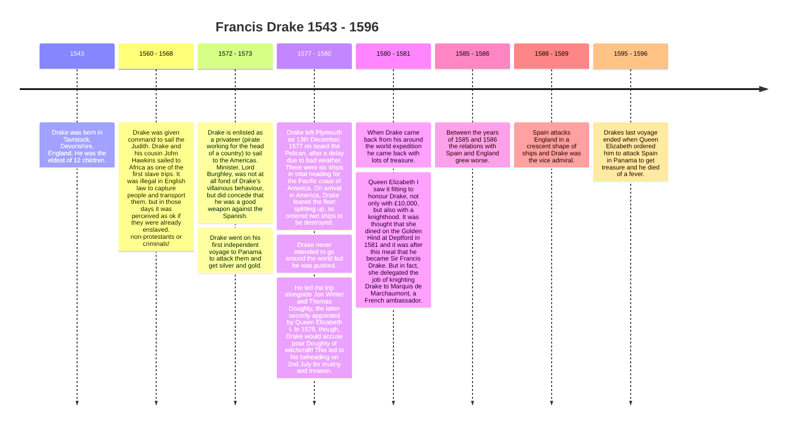

# English History

A Timeline of key events in the life of Sir Francis Drake

```mermaid
timeline
    title Francis Drake 1543 - 1596
    1543 
                : Drake was born in Tavistock, Devonshire, England. He was the eldest of 12 children.
    1560 - 1568 
                : Drake was given command to sail the Judith. Drake and his cousin John Hawkins sailed to Africa as one of the first slave trips. It was illegal in English law to capture people and transport them, but in those days it was perceived as ok if they were already enslaved, non-protestants or criminals!
    1572 - 1573 
                : Drake is enlisted as a privateer (pirate working for the head of a country) to sail to the Americas. Minister, Lord Burghley, was not at all fond of Drake’s villainous behaviour, but did concede that he was a good weapon against the Spanish.
                : Drake went on his first independent voyage to Panama to attack them and get silver and gold.
    1577 - 1580 
                : Drake left Plymouth on 13th December, 1577 on board the Pelican, after a delay due to bad weather. There were six ships in total heading for the Pacific coast of America. On arrival in America, Drake feared the fleet splitting up, so ordered two ships to be destroyed.
                : Drake never intended to go around the world but he was pushed.
                : He led the trip alongside Jon Winter and Thomas Doughty, the latter secretly appointed by Queen Elizabeth I. In 1578, though, Drake would accuse poor Doughty of witchcraft! This led to his beheading on 2nd July for mutiny and treason.
    1580 - 1581 
                : When Drake came back from his around the world expedition he came back with lots of treasure.
                : Queen Elizabeth I saw it fitting to honour Drake, not only with £10,000, but also with a knighthood. It was thought that she dined on the Golden Hind at Deptford in 1581 and it was after this meal that he became Sir Francis Drake. But in fact, she delegated the job of knighting Drake to Marquis de Marchaumont, a French ambassador.
    1585 - 1586 
                : Between the years of 1585 and 1586 the relations with Spain and England grew worse.
    1588 - 1589 
                : Spain attacks England in a crescent shape of ships and Drake was the vice admiral.
    1595 - 1596 
                : Drakes last voyage ended when Queen Elizabeth ordered him to attack Spain in Panama to get treasure and he died of a fever.
```