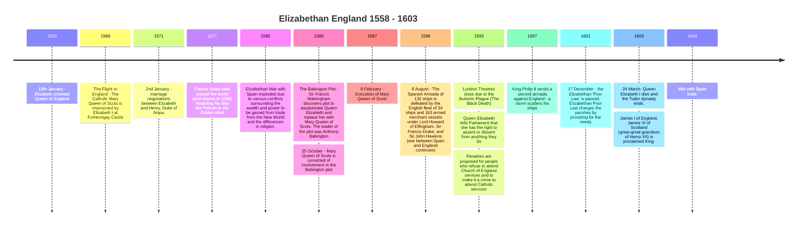

# English History

A Timeline of key events in English History from 1558 to 1603

```mermaid
timeline
    title Elizabethan England 1558 - 1603 
    1559 : 13th January - Elizabeth crowned Queen of England
    1568 : The Flight to England - The Catholic Mary Queen of Scots is imprisoned by Elizabeth I at Fotheringay Castle
    1571 : 2nd January - marriage negotiations between Elizabeth and Henry, Duke of Anjou
    1577 : Francis Drake sails around the world (and returns in 1580) renaming his ship the Pelican to  the Golden Hind
    1585 : Elizabethan War with Spain exploded due to various conflicts surrounding the wealth and power to be gained from trade from the New World and the differences in religion.
    1586 : The Babington Plot - Sir Francis Walsingham discovers plot to assassinate Queen Elizabeth and replace her with Mary Queen of Scots. The leader of the plot was Anthony Babington
         : 25 October - Mary Queen of Scots is convicted of involvement in the Babington plot
    1587 : 8 February - Execution of Mary Queen of Scots
    1588 :  8 August - The Spanish Armada of 132 ships is defeated by the English fleet of  34 ships and 163 armed merchant vessels under Lord Howard of Effingham, Sir Francis Drake, and Sir John Hawkins (war between Spain and England continues)
    1593 : London Theatres close due to the Bubonic Plague (The Black Death)
         : Queen Elizabeth tells Parliament that she has the right to assent or dissent from anything they do
         : Penalties are proposed for people who refuse to attend Church of England services and to make it a crime to attend Catholic services
    1597 : King Philip II sends a second armada against England - a storm scatters his ships
    1601 : 17 December - the Elizabethan 'Poor Law' is passed. Elizabethan Poor Law charges the parishes by providing for the needy
    1603 : 24 March- Queen Elizabeth I dies and the Tudor dynasty ends. 
         : James I of England, James VI of Scotland (great-great-grandson of Henry VII) is proclaimed King.
    1604 : War with Spain ends.
```