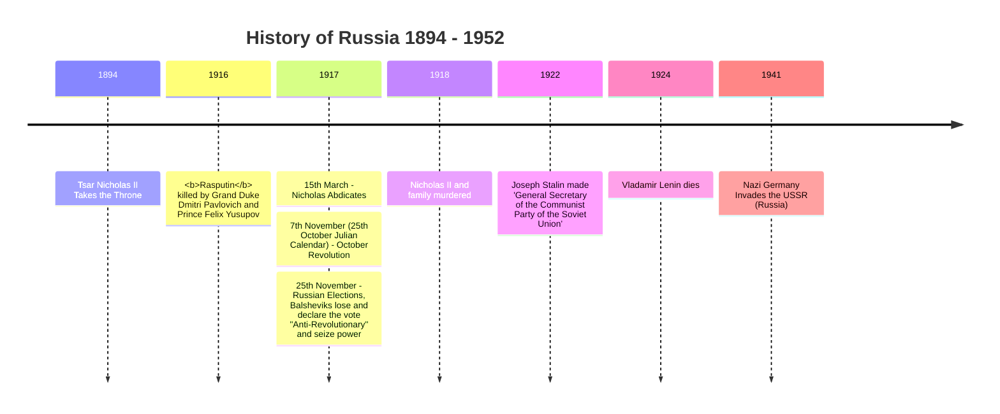

# Russian History
A Timeline of key events in Russias History

```mermaid
timeline
    title History of Russia 1894 - 1952
    1894 : Tsar Nicholas II Takes the Throne
    1916 : <b>Rasputin</b> killed by Grand Duke Dmitri Pavlovich and Prince Felix Yusupov
    1917 : 15th March - Nicholas Abdicates
         : 7th November (25th October Julian Calendar) - October Revolution
         : 25th November - Russian Elections, Balsheviks lose and declare the vote "Anti-Revolutionary" and seize power
    1918 : Nicholas II and family murdered
    1922 : Joseph Stalin made 'General Secretary of the Communist Party of the Soviet Union'
    1924 : Vladamir Lenin dies
    1941 : Nazi Germany Invades the USSR (Russia)
```
